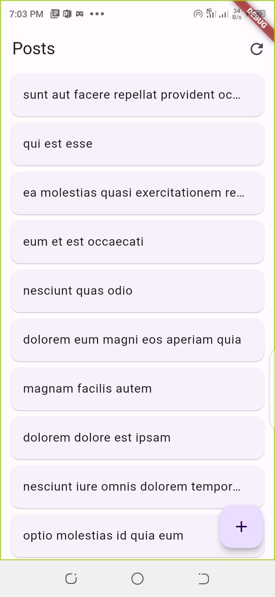
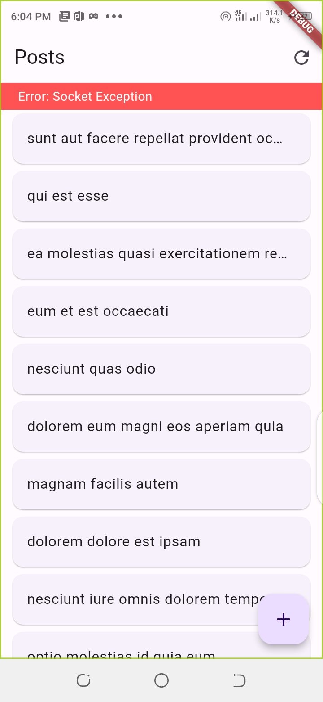
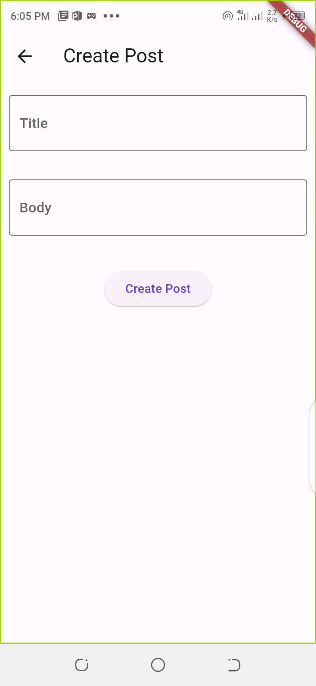
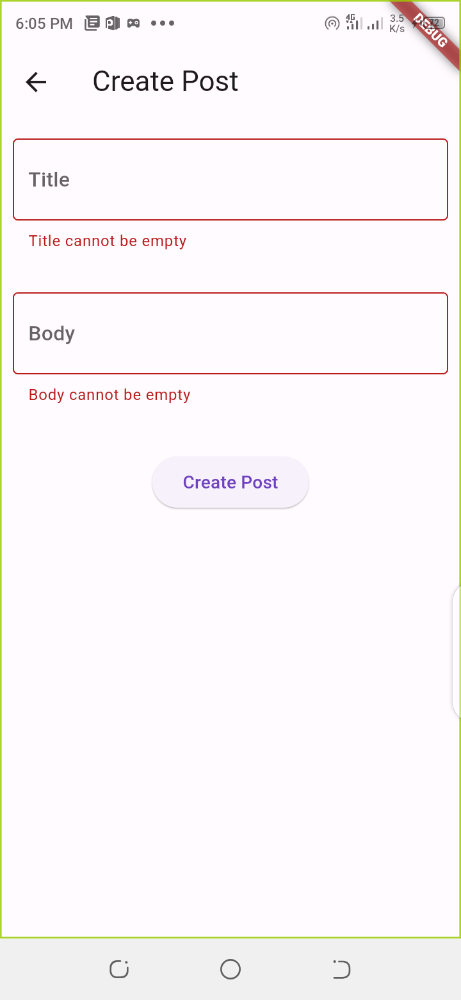
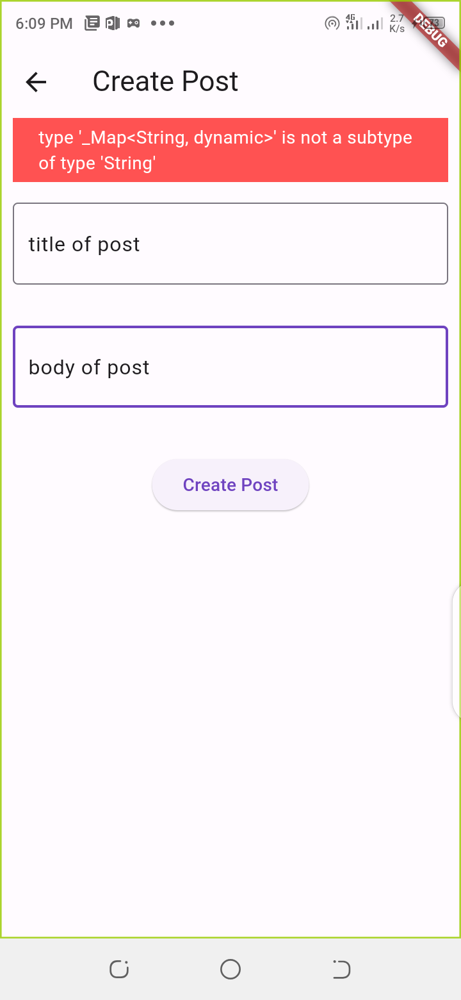

# Schello

A Task following the interview from schello

## Tasks 
- [x] Bloc State management
- [x] Get all Posts
- [x] View Post Details
- [x] Create Posts

## Project requirements
Additional Libraries:
flutter_bloc
equatable
either_dart
flutter_toast

> The project does not require any additional or configuration

## Running the App

- Pull the project from this repository
- in the terminal run `flutter pub get` to get dependencies
- run the app

## Screenshots
| page name | image |
|-----------|-------|
| post list |  |
| post list with error |  |
| create post |  |
| create post field validation |  |
| create post with error |  |